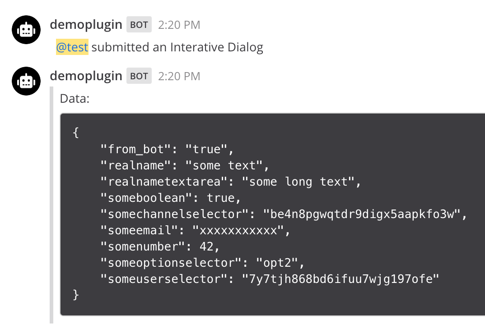

## Interactive Dialogs

The `/dialog` command demonstrates [Interactive Dialogs](https://docs.mattermost.com/developer/interactive-dialogs.html). Use `/dialog help` for its usage in this demo plugin.

#### `/dialog`:

##### When entering an invalid number:

##### After confirming the dialog:

#### `/dialog no-elements`:

##### After confirming the dialog:

#### After cancelling the dialog:

