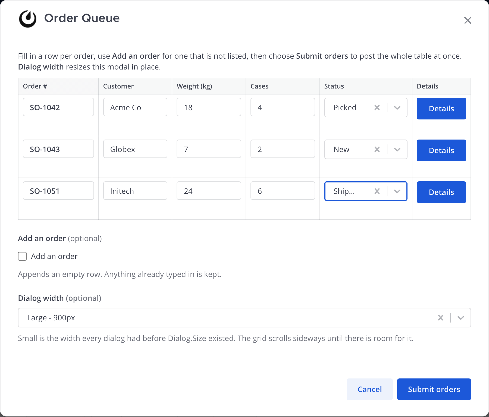
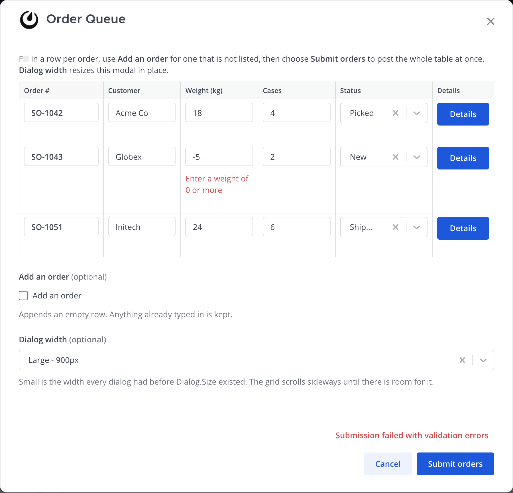
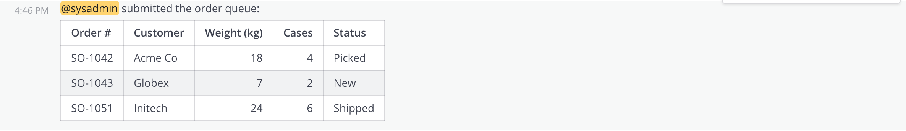
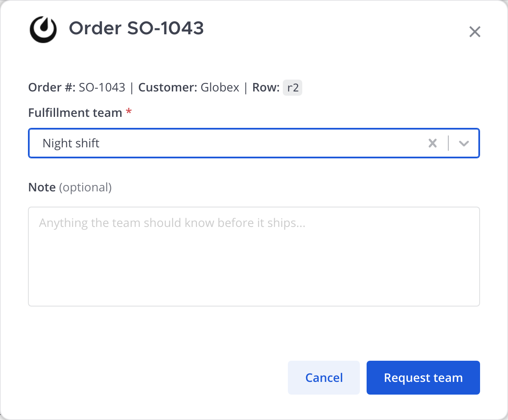

# `/dialog fillable-table`

A fillable table inside an Interactive Dialog: a row per record, a column per
field, values typed straight into the grid and submitted in one go.



The grid is a **layout over ordinary dialog elements**, not a new element type
with its own submission protocol. Every cell is a real `DialogElement` with a
synthesized name (`cell_r2_weight`), the cells of one row are grouped in a
`collapsible`, and those row collapsibles sit inside one more collapsible
carrying `SubType: "grid"`, which is what asks the webapp to lay them out as a
table.

The webapp side of that layout — and `Dialog.Size`, the width tier the sample's
selector drives — is [mattermost/mattermost#39082][core-pr]. This sample is the
plugin-side demonstration of it.

[core-pr]: https://github.com/mattermost/mattermost/pull/39082

## Why it costs so little

Collapsible children already flatten into the top-level submission map, and the
`Errors` map is already keyed by element name. So nothing downstream has to
learn about grids:

| Concern | How it already works |
|:---|:---|
| Typed cell values | Arrive in `Submission` as ordinary named fields |
| Per-cell errors | The flat `Errors` map is keyed by element name, and cell names are unique |
| Required / optional per cell | `Optional` on the cell element |
| Numeric cells | `Type: "text"`, `SubType: "number"` |
| Constrained cells | `Type: "select"` with `Options` |
| Value persistence across a refresh | The handler folds `Submission` back into the rows and re-emits them as `Default` |
| Adding rows | The existing refresh path: the handler returns a form and the open modal swaps its contents |

Neither the submission model nor the error model changes, and a cell needs no
new plumbing to be required, numeric, constrained or pre-filled.

## How the sample is put together

The data is a warehouse order queue: a few orders with a weight, a case count
and a status to fill in.

- **The grid travels in `Dialog.State`** as JSON, with the chosen width. Nothing
  is stored server side. State comes back from the client, so it is treated as
  untrusted: a grid over `maxOrderRows` is rejected, a row with no id is
  rejected, an unrecognised width falls back to small, and cells are escaped
  before they reach the posted table.
- **"Add an order" is a `bool` with `Refresh: true`.** Toggling it sends a
  refresh, and the handler answers with the same form plus one blank row.
  Anything already typed in survives, because the submitted cell values are
  folded back into the rows and re-emitted as each cell's `Default`.
- **"Dialog width" is a `select` with `Refresh: true`.** It returns the same
  form at a different `Dialog.Size`, so the open modal resizes in place rather
  than reopening.
- **The row header is the row's first cell**, and it stays editable: the webapp
  renders it in a sticky `<th scope="row">` so it stays put while a wide grid
  scrolls sideways. Renaming the leftmost column means renaming that element;
  there is no separate corner label, and the container's own `DisplayName` is
  the section title only if the same form renders stacked.
- **Each cell's own label is visually hidden** (kept for assistive technology),
  because the column header carries the text.
- **Submitting** validates every cell and posts the whole queue as a Markdown
  pipe table. A validation failure comes back as per-cell errors and leaves the
  modal open with everything intact.

An error returned for one cell lands under that cell and nowhere else, because
the `Errors` map is keyed by element name and cell names are unique:



Note that the webapp enforces required fields client-side before the request is
sent, so the server-side checks in `validateOrders` are defence in depth rather
than the first line. Forcing a server round trip needs a value the client
accepts and the server rejects, which is what the negative weight above does.

A valid queue posts as one Markdown table:



## A button in each row

The last column is a button rather than an input: an `action_button` cell with a
per-row `Context`, which opens a child dialog for that order.



```go
DisplayName: "Details",
Name:        cellName(row.ID, fillableDetailsColumn),
Type:        "action_button",
Optional:    true,
ActionButton: &model.DialogActionButton{
    URL:     "/plugins/<id>/dialog/fillable-table/row-action",
    Context: map[string]string{"row_id": row.ID, "order": row.Order, "customer": row.Customer},
},
```

This needs no change to the grid: a cell is rendered through the form's ordinary
`renderField`, so an `action_button` lands in its `<td>` the same way a text
input does. `convertAppFormValuesToDialogSubmission` skips action buttons before
the required-value check, so a button cell never trips validation.

**What the button can and cannot do.** A click is a *separate request* from the
dialog it sits in: it arrives as a `PostActionIntegrationRequest` carrying the
button's static `Context` and a fresh trigger ID, with no submission attached.
So it cannot see what the user has typed into the grid since the last refresh,
and — because a plugin cannot update a dialog that is already open — it cannot
edit or delete its own row; the parent queue would keep showing the old table.
Opening a child dialog on top is what it is for. Row mutation belongs on the
refresh path instead, the way "Add an order" works.

A per-row **Remove** button would therefore want an `action_button` that
refreshes rather than one that calls out. The wrinkle is that refresh is fired
from `onChange`, keyed to a value change, and a button has no value. Until then
the only working remove control is a per-row `bool` with `Refresh: true`, which
works end to end but renders as a checkbox.

## Limits worth knowing

- **Mobile does not render this yet.** The mobile app converts dialogs with its
  own `app/utils/dialog_conversion.ts`, which has no `collapsible` case at all,
  so a collapsible — grid or not — falls through to a plain text field and its
  children never appear. Grid support on mobile is a change to that converter,
  not to this plugin.
- A `number` subtype is a whole number in the browser, whatever the server
  accepts: `widgets/settings/text_setting.tsx` reads the input with `parseInt`,
  so a typed `7.5` reaches the plugin as `7` with nothing said. That is true of
  every Interactive Dialog, not just a grid, which is why the Weight column here
  asks for whole kilograms.
- `DialogElementDisplayNameMaxLength` is 24, so column labels have to be short.
  "Weight (kg)" fits; a longer real-world column name might not. A `DisplayName`
  is required on every element, so a column header cannot be left blank — which
  for the button column means the header repeats the button's own label.
- Column headers come from the first row, so every row is expected to hold the
  same fields in the same order — which is what `orderRowElements` guarantees by
  building every row from one column definition. A mismatched row still lays out
  rather than losing cells: a short row is padded on the right instead of being
  shifted under the wrong column, and a row longer than the first widens the
  table.
- A `<th scope="row">` containing an input is a weaker row header for a screen
  reader than static text would be. The cell's hidden label still names the
  field.
- The form definition grows with the data, and each added row is a server round
  trip. That is fine for a queue of a dozen rows and would not be for hundreds.

## Files

| File | Role |
|:---|:---|
| `server/fillable_table.go` | Row model, state encode/decode, cell naming, `validateOrders`, the Markdown table |
| `server/dialog_samples.go` | `getDialogWithFillableTable`, `orderRowElements` (the column definition, including the Details button), `getDialogFillableTableRowDetails` (the child dialog) |
| `server/http_hooks.go` | `/dialog/fillable-table` and `handleDialogFillableTable`; `/row-action` and `/row-details` for the per-row Details button |
| `server/command_hooks.go` | The `fillable-table` case, help line, autocomplete entry |
| `server/fillable_table_test.go` | Unit tests for the row logic and the dialogs, and handler tests for the refresh, submit and button round trips |
